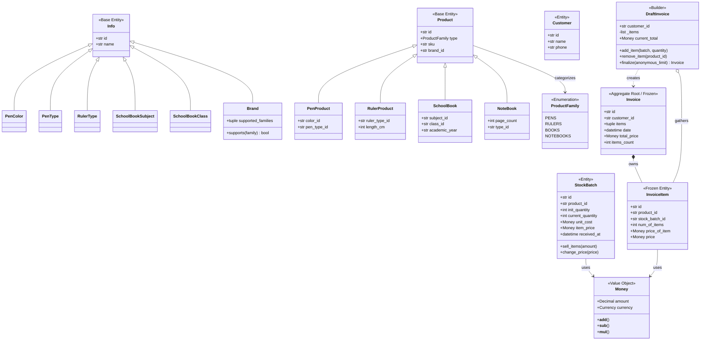

#library inventory system

```mermaid

classDiagram
    %% --- Value Objects & Enums ---
    class Money {
        <<Value Object>>
        +Decimal amount
        +Currency currency
        +__add__()
        +__sub__()
        +__mul__()
    }
    
    class ProductFamily {
        <<Enumeration>>
        PENS
        RULERS
        BOOKS
        NOTEBOOKS
    }

    %% --- Shared Base Classes ---
    class Info {
        <<Base Entity>>
        +str id
        +str name
    }
    
    class Product {
        <<Base Entity>>
        +str id
        +ProductFamily type
        +str sku
        +str brand_id
    }

    %% --- Info Derived Classes ---
    Info <|-- PenColor
    Info <|-- PenType
    Info <|-- RulerType
    Info <|-- SchoolBookSubject
    Info <|-- SchoolBookClass
    Info <|-- Brand

    class Brand {
        +tuple supported_families
        +supports(family) bool
    }

    %% --- Products Hierarchy (Polymorphism) ---
    Product <|-- PenProduct
    class PenProduct {
        +str color_id
        +str pen_type_id
    }

    Product <|-- RulerProduct
    class RulerProduct {
        +str ruler_type_id
        +int length_cm
    }

    Product <|-- SchoolBook
    class SchoolBook {
        +str subject_id
        +str class_id
        +str academic_year
    }

    Product <|-- NoteBook
    class NoteBook {
        +int page_count
        +str type_id
    }

    %% --- Core Entities ---
    class Customer {
        <<Entity>>
        +str id
        +str name
        +str phone
    }

    class StockBatch {
        <<Entity>>
        +str id
        +str product_id
        +int init_quantity
        +int current_quantity
        +Money unit_cost
        +Money item_price
        +datetime received_at
        +sell_items(amount)
        +change_price(price)
    }

    %% --- Invoice Aggregate (Builder Pattern) ---
    class DraftInvoice {
        <<Builder>>
        +str customer_id
        -list _items
        +Money current_total
        +add_item(batch, quantity)
        +remove_item(product_id)
        +finalize(anonymous_limit) Invoice
    }

    class InvoiceItem {
        <<Frozen Entity>>
        +str id
        +str product_id
        +str stock_batch_id
        +int num_of_items
        +Money price_of_item
        +Money price
    }

    class Invoice {
        <<Aggregate Root / Frozen>>
        +str id
        +str customer_id
        +tuple items
        +datetime date
        +Money total_price
        +int items_count
    }

    %% --- Relationships ---
    DraftInvoice ..> Invoice : creates
    DraftInvoice o-- InvoiceItem : gathers
    Invoice *-- InvoiceItem : owns
    InvoiceItem --> Money : uses
    StockBatch --> Money : uses
    Product --> ProductFamily : categorizes
```
